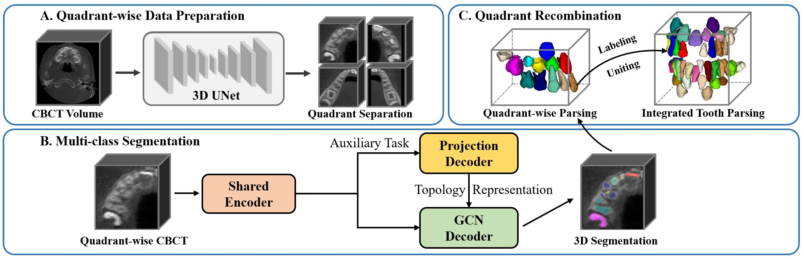

# Individual Graph Representation Learning for Pediatric Tooth Segmentation from Dental CBCT
_By Yusheng Liu<sup>a</sup>(lys_sjtu@sjtu.edu.cn), Shu Zhang<sup>b</sup>, Xiyi Wu<sup>a</sup>, Tao Yang<sup>a</sup>, Yuchen Pei<sup>a</sup>, Huayan Guo<sup>e</sup>, Yuxian Jiang<sup>a</sup>, Zhien Feng<sup>c</sup>, Wen Xiao<sup>d</sup>, Yu-Ping Wang<sup>e</sup>, and Lisheng Wang<sup>a</sup>(lswang@sjtu.edu.cn)_

_a.Department of Automation, Shanghai Jiao Tong University, Shanghai 200240, People’s Republic of China._  
_b.Department of Pediatric Dentistry, Beijing Stomatological Hospital, Capital Medical University, Beijing 100050, China._  
_c.Department of Oral and Maxillofacial-Head and Neck Oncology, Beijing Stomatological Hospital, Capital Medical University, Beijing 100050, China._  
_d.Department of International Medicine, Shanghai Ninth People’s Hospital, Shanghai 200011, China._    
_e.Department of Dentistry, Shanghai East Hospital Affiliated to Tongji University, Shanghai 200120, China._  
_f.The Biomedical Engineering Department, Tulane University, New Orleans, LA 70118 USA._  

## Introduction
**This code repository is for our paper 'Individual Graph Representation Learning for Pediatric Tooth Segmentation from Dental CBCT' published by IEEE Transactions on Medical Imaging.**


**The pipeline of the proposed segmentation framework is shown in Figure.A below.**     
Our method will first segment four quadrants from a CBCT by a trained UNet. Subsequently, TSG-GCN segments teeth within each quadrant. The aggregation of teeth from the four quadrants yields the final segmentation results.   


**In this section, we present the TSG-GCN architecture characterized by the encoder-decoder framework.**    
It incorporates a unified encoder, a 2D projection decoder for adaptive adjacency matrix learning, and a 3D GCN-driven decoder tailored fo nuanced multi-class teeth segmentation, as depicted in Figure.B below.       


## Environments Configuration & Data Preparation
This repository is based on PyTorch 1.12.1.  
1. Clone the repository, and then install the related dependencies with pip.
```
git clone https://github.com/GaryNico517/TSG-GCN.git
cd TSG-GCN
pip install -r requirements.txt
```
2. Preparing your own dataset by segmenting four quadrants from CBCTs using your customized code, and relabeling the teeth as background(0), permanent(1-8), deciduous(9-13), supernumerary teeth(14) and irrelevant teeth(15).
## Training Procedure
### Training Quadrant Segmentation Network
1. Relabel the teeth in four quadrant of the full-scale CBCTs as 1, 2, 3, 4, respectively.
2. Train the Quadrant Segmentation Network using whatever model you prefer, including 3DUNet, nnUNet, and so forth.
### Training Topology Structure-guided Graph Convolutional Network (TSG-GCN)
1. Set the experiment & dataset configuration in `Network_Configuration.py`.
2. Easily Train TSG-GCN using the default settings.
```
python Network_Configuration.py --data_seed_list 1 --job_list GCN --data_split_list Child_Tooth_quadrant --GNN_model GCN --SEG_AM_DM 1,1,0 --Test_only False
```
## Inference Procedure
### Inference the Quarant-wise data using TSG-GCN
1. Choose the weight dir and related hyperparams in `Network_Configuration.py`.  
For example:
```
parser.add_argument('--checkpoint_dir', type=str, required=False, default='model/TSG-GCN')
parser.add_argument('--model_load_path', type=str, required=False,default='model/TSG-GCN/save/best_model-1-0.1109-0.2452-0.0722-0.0000-0.0000.pth')
parser.add_argument('--model_load', type=bool, required=False,default=True)
```
2. Easily Inference by executing the following instruction.
```
python Network_Configuration.py --data_seed_list 1 --job_list GCN --data_split_list Child_Tooth_quadrant --GNN_model GCN --SEG_AM_DM 1,1,0 --Test_only True
```
### Inference the full-scale CBCT data using the proposed framework
1. Choose the weights of Quadrant Segment and Tooth Segment and related hyperparams in `pipeline/Procedure_Tooth_Parsing.py`.
Here, we use 3DUNet as the Quadrant Segmentation Model.
```
    parser.add_argument('--pred_dir_QuadrantSeg', type=str, required=False,
                        default=r'/media/ps/lys_ssd/Project/Project_Multi_Child_TMI/data_GCN/child_multi_center/Center1_sup_2/predict') # result path
    parser.add_argument("--checkpoint_dir_QuadrantSeg", type=str, required=False,
                        default='../result_Project/Child_Tooth_quadrant/seed1/model/3DUNet_Quadrant/save/best_model-490-0.9307,0.9326,0.9291.pth')
    parser.add_argument('--test_dir_QuadrantSeg', type=str, required=False,
                        default=r'/media/ps/lys_ssd/Project/Project_Multi_Child_TMI/data_GCN/child_multi_center/Center1_sup_2/data')  # test data path
    parser.add_argument('--checkpoint_dir_ToothSeg', type=str, required=False,
                        default=r'../result_Project/Child_Tooth_quadrant/seed1/model/TSG-GCN/save/best_model-290-0.9425-0.9409-0.9444-0.0543-0.0000.pth')
```
2. Easily run the whole pipeline, including quadrant-wise data segmentation, tooth segmentation as well as quadrant recombination.
```
cd pipeline
python Procedure_Tooth_Parsing.py
```
## Citations (Updating)
If you find this repository useful, please consider citing our paper:  
```
 DOI: 10.1109/TMI.2024.3501365
```


