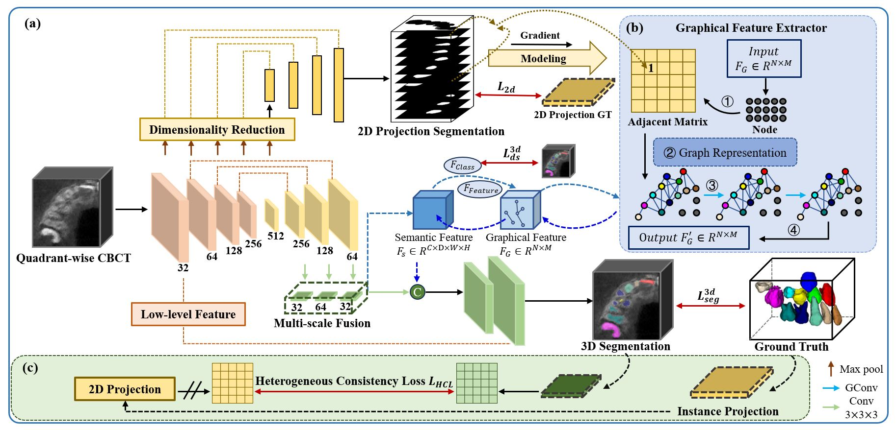

# Individual Graph Representation Learning for Pediatric Tooth Segmentation from Dental CBCT
_By Yusheng Liua(lys_sjtu@sjtu.edu.cn), Shu Zhangb, Xiyi Wua, Tao Yanga, Yuchen Peia, Huayan Guoe, Yuxian Jianga, Zhien Fengc, Wen Xiaod, Yu-Ping Wange, and Lisheng Wanga(lswang@sjtu.edu.cn)_

_a.Department of Automation, Shanghai Jiao Tong University, Shanghai 200240, People’s Republic of China._  
_b.Department of Pediatric Dentistry, Beijing Stomatological Hospital, Capital Medical University, Beijing 100050, China._  
_c.Department of Oral and Maxillofacial-Head and Neck Oncology, Beijing Stomatological Hospital, Capital Medical University, Beijing 100050, China._  
_d.Department of Pediatric Dentistry, Shanghai Ninth People’s Hospital, Shanghai 200011, China._    
_e.Department of Dentistry, Shanghai East Hospital Affiliated to Tongji University, Shanghai 200120, China._  
_f.The Biomedical Engineering Department, Tulane University, New Orleans, LA 70118 USA._  

## Introduction:
This code repository is for our paper 'Individual Graph Representation Learning for Pediatric Tooth Segmentation from Dental CBCT' published by IEEE Transactions on Medical Imaging.
The pipeline of the proposed segmentation framework is shown in Figure below.  

## Supplemental Weight:
### nnUNet-based
The training weights are for 1) Quadrant-wise Localization as well as 2) Tooth Segmentation on Quadrant-wise Data.  
The dataset used for training is a publicly available teeth dataset, containing:  
a) 76 CBCT images come from https://github.com/ErdanC/Tooth-and-alveolar-bone-segmentation-from-CBCT/  
b) 63 CBCT images come from https://ditto.ing.unimore.it/toothfairy2/  
You can easliy download the weights from https://drive.google.com/drive/folders/1-Kkm0C5huUZu_T04ciR5hRTn7G6lZbpd?usp=drive_link

## More code will be uploaded soon.

